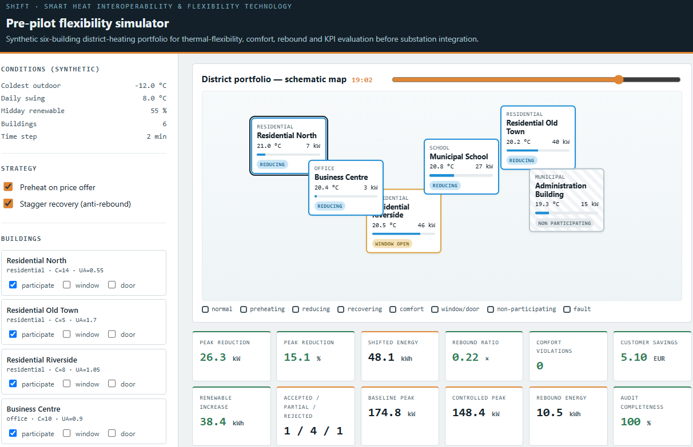
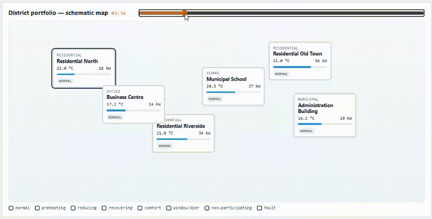
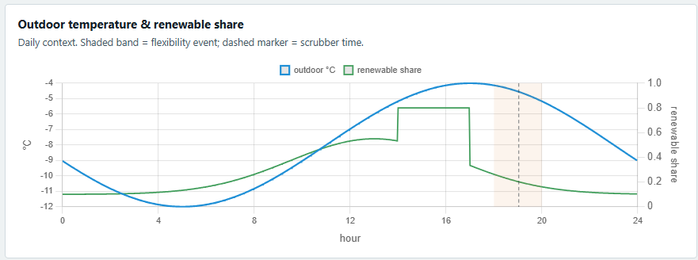
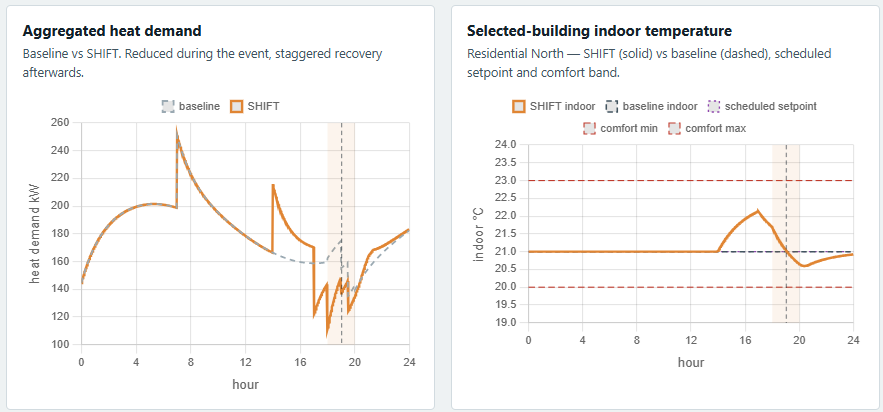
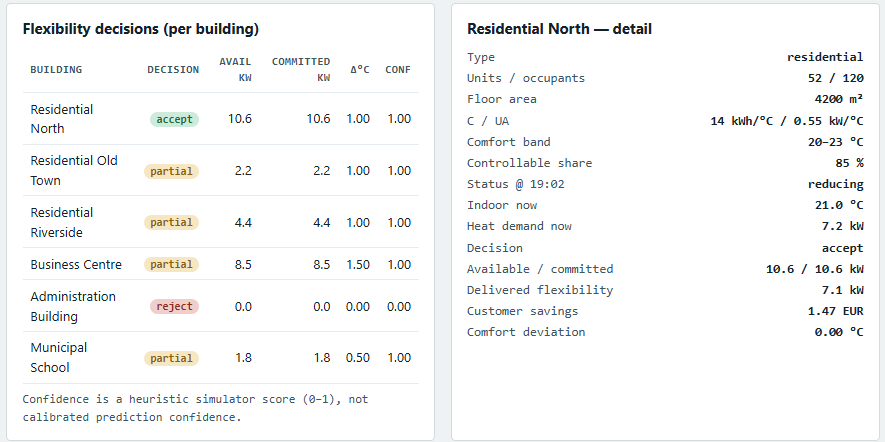
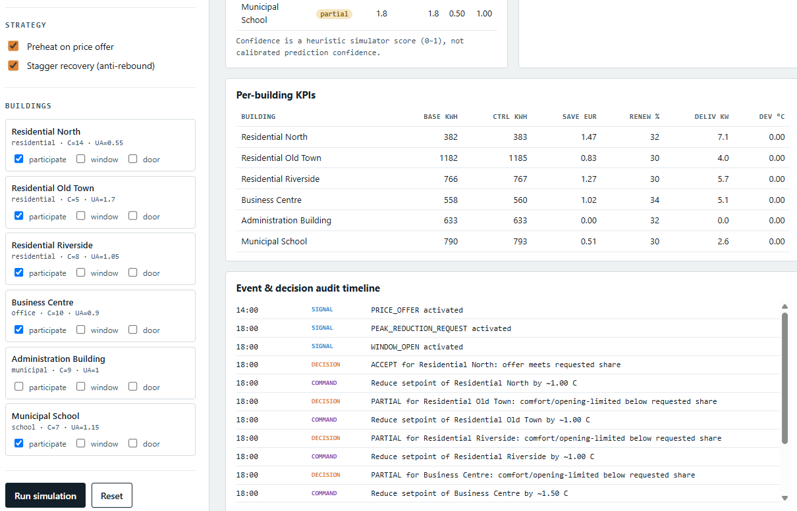

# SHIFT — Smart Heat Interoperability and Flexibility Technology

A **synthetic pre-pilot simulator** for **district-heating demand response**.

SHIFT turns district-heated buildings from passive heat consumers into  controllable providers of measurable thermal flexibility. This repository is a *simulator* that verifies the thermal-balance, flexibility-assessment, comfort and rebound **control and KPI logic** for a portfolio of buildings **before** any 
heat substation is connected.

> ### What this is — and is not
> - **Synthetic.** No real data are used. All buildings,
>   coordinates, prices and renewable shares are **assumptions**.
> - **1R1C, space heating only.** A lumped single-node thermal model. There is
>   **no** domestic-hot-water / legionella hygiene model (future work).
> - **Exact baseline.** The baseline is a parallel deterministic counterfactual,
>   **not** a weather-normalised learned forecast. No NMAE/forecast-confidence is
>   shown as if it were measured.
> - **Verifies logic, not operations.** It checks control decisions and KPI
>   arithmetic.

The challenge owner's workflow (received from DESTO and transferred from a single
domestic water heater to whole-building substations): receive a network
flexibility signal → assess available flexibility (kW) per building → accept /
partially accept / reject → preheat, delay or reduce → exploit thermal inertia
within the comfort band → execute over (simulated) substation interfaces →
restore with staggered recovery → log everything.

---

## Dashboard

The offline dashboard (`web/dashboard.html`, served by `python server.py`) runs a
one-shot deterministic simulation and renders a schematic building map, KPI cards,
time-series charts, per-building flexibility decisions and a full audit timeline.

[](./media/dashboard-overview.png)

*Overview: the left console (synthetic conditions, strategy toggles and
per-building participation/window/door controls), the schematic district map with
live building statuses, and the portfolio KPI cards (peak reduction, shifted
energy, rebound ratio, comfort violations, customer savings, audit completeness).*

A time scrubber moves through the simulated day without re-running the model.

[](./media/shift-time-slider-demo.gif)

*Time scrubber: dragging the slider updates each building's indoor temperature,
heat demand and control status on the schematic map (preheating → reducing →
recovering) and moves the marker on every chart — no re-simulation.*

[](./media/context-chart.png)

*Daily context: synthetic outdoor temperature and renewable share. The shaded
band marks the flexibility event window and the dashed line is the scrubber time.*

[](./media/demand-and-temperature-charts.png)

*Left — aggregated portfolio heat demand, baseline vs SHIFT: reduced during the
event and returned via staggered recovery. Right — the selected building's indoor
temperature (SHIFT vs baseline) against its scheduled setpoint and comfort band,
showing preheating and comfort protection.*

[](./media/flexibility-decisions-and-detail.png)

*Flexibility decisions per building (accept / partial / reject, available and
committed kW, expected ΔT, heuristic confidence) alongside the detail panel for
the selected building.*

[](./media/per-building-kpis-and-audit.png)

*Per-building KPIs (baseline vs controlled energy, savings, renewable share,
delivered flexibility, comfort deviation) and the timestamped audit timeline of
every signal, decision and command.*

---

## Quick start

**Primary environment: Linux / Bash.**

```bash
python3 -m venv .venv
source .venv/bin/activate
pip install -r requirements.txt

python server.py            # open http://localhost:8765
python -m shift_sim         # headless: run the scenario, print KPIs
python -m shift_sim --csv demand.csv   # also export the demand time series
pytest -q                   # run the test suite
pytest tests/test_acceptance.py -q     # the acceptance scenario only
```

**Secondary — Windows PowerShell:**

```powershell
python -m venv .venv
.\.venv\Scripts\Activate.ps1
pip install -r requirements.txt
python server.py
python -m shift_sim
pytest -q
```

Dependencies are minimal by design: **`pyyaml`** and **`pytest`** only. The
engine and server use the Python standard library; Chart.js v4.4.1 (MIT) is
vendored offline in `web/chart.umd.js`.

---

## The default scenario (six synthetic buildings, cold winter day)

| Building | Type | Character | Typical outcome |
|----------|------|-----------|-----------------|
| Residential North | residential | modern, well-insulated, high mass | preheats, **accepts** |
| Residential Old Town | residential | older, high heat loss | **partial** |
| Residential Riverside | residential | medium; window-open event | reduced flexibility → **partial** |
| Business Centre | office | daytime schedule, night setback | preheats, **partial** |
| Administration Building | municipal | **participation disabled** | **reject** |
| Municipal School | school | tight comfort band | comfort-limited → **partial** |

Timeline: a high-renewable **discounted price offer 14:00–17:00** (suitable
buildings preheat within their comfort maximum), then a portfolio
**peak-reduction request 18:00–20:00** with per-building accept/partial/reject,
reduced demand, staggered recovery and complete audit records.

Use the dashboard's **time scrubber** to move through the day and watch each
building's status on the schematic map (normal / preheating / reducing /
recovering / comfort / window / non-participating / fault). Click a building to
open its detail panel and compare its baseline against SHIFT.

---

## Default Scenario Results

The following values are produced deterministically from the committed
`config.yaml` using six synthetic buildings:

```bash
python -m shift_sim
```

| KPI | Default scenario result |
|---|---:|
| Peak reduction | 26.3 kW / 15.1% |
| Shifted thermal energy | 48.1 kWh |
| Rebound ratio | 0.22×, target ≤ 0.8 |
| Renewable thermal-energy increase | +38.4 kWh |
| Total customer savings | +€5.10 |
| Flexibility decisions | 1 accepted / 4 partial / 1 rejected |
| Comfort violations | 0 |
| Audit completeness | 100% |

Residential North accepts **10.6 kW** of flexibility. Residential Old Town,
Residential Riverside, Business Centre and Municipal School partially accept
the request. Administration Building rejects it because flexibility
participation is disabled.

The simulated portfolio reduces the selected peak by **15.1%** without
violating the configured comfort limits. Preheating during the low-price,
higher-renewable period shifts **38.4 kWh** of thermal consumption into a
higher-renewable period, while staggered recovery keeps the rebound ratio at
**0.22**.

Customer savings are calculated using the synthetic thermal-price and incentive
assumptions in `config.yaml`.

The numerical acceptance conditions are verified by
`tests/test_acceptance.py`.

> These values are deterministic outputs from the synthetic default scenario.
> They do not represent measured performance from any buildings.
> Building parameters, tariffs, renewable shares and event conditions must be
> recalibrated using pilot data before operational conclusions are made.

---

## Units & the cost convention

| Quantity | Unit |
|----------|------|
| temperature | °C |
| thermal power | kW |
| thermal energy | kWh |
| thermal capacity `C` | kWh/°C |
| heat-loss coefficient `UA` | kW/°C |
| price | **EUR/MWh (thermal)** |

Single cost formula, used everywhere: `cost_eur = energy_kwh * price_eur_per_mwh / 1000`.

---

## Configuration

- `config.yaml` — the committed default (full six-building scenario). **Every
  synthetic assumption lives here** (buildings, map coordinates, weather,
  renewable and price profiles, setpoint/occupancy schedules, comfort bands,
  participation, controllable share, opening multipliers, operator events,
  preheating and recovery staggering).
- `config.local.yaml` (git-ignored) — optional machine-local overrides,
  deep-merged onto the committed config. Copy `config.local.yaml.example` to
  start.

---

## Project layout

```
shift/
├── config.yaml / config.local.yaml.example   # scenario + overrides
├── requirements.txt                          # pyyaml, pytest
├── server.py                                 # stdlib HTTP server + JSON API
├── shift_sim/                                # pure-Python simulation engine
│   ├── config, profiles, building, substation, events,
│   ├── flexibility, controller, scenario, simulator, kpis, audit
│   └── __main__.py                           # CLI runner
├── web/  dashboard.html + chart.umd.js       # offline dashboard
├── tests/                                    # pytest suite (unit + API + acceptance)
├── docs/  ARCHITECTURE.md + IMPLEMENTATION_PLAN.md
├── prototype/                                # original PoC (reference only)
└── references/                               # challenge & domain documents
```

See [`docs/ARCHITECTURE.md`](docs/ARCHITECTURE.md) for the design and
[`docs/IMPLEMENTATION_PLAN.md`](docs/IMPLEMENTATION_PLAN.md) for the build plan,
KPI/API/config schemas and testing strategy.

## HTTP API

| Method | Path | Purpose |
|--------|------|---------|
| GET | `/` | dashboard |
| GET | `/config` | merged configuration (JSON) |
| GET | `/health` | liveness |
| POST | `/simulate` | full baseline + SHIFT result, KPIs, envelopes, audit, map state |
| POST | `/flexibility/assess` | envelopes + decisions only |

`POST` bodies accept `overrides` (deep-merged config), `participation`
(`{building_id: bool}`), and `manual_window` / `manual_door`
(`{building_id: true}`).

---

## Future work (out of scope for this MVP)

Real weather-normalised baseline forecasting (measured via NMAE), a separate
domestic-hot-water tank / legionella-hygiene model, 2R2C and multi-zone thermal
models, FIWARE/NGSI-LD + SAREF substation integration, model-predictive control,
and the long-term economics module (NPV/IRR/payback, avoided peak-generation
valuation, long-term CO₂) — deliberately excluded here.

---

*SHIFT · High Performance Creators Ltd. Synthetic pre-pilot simulator*
